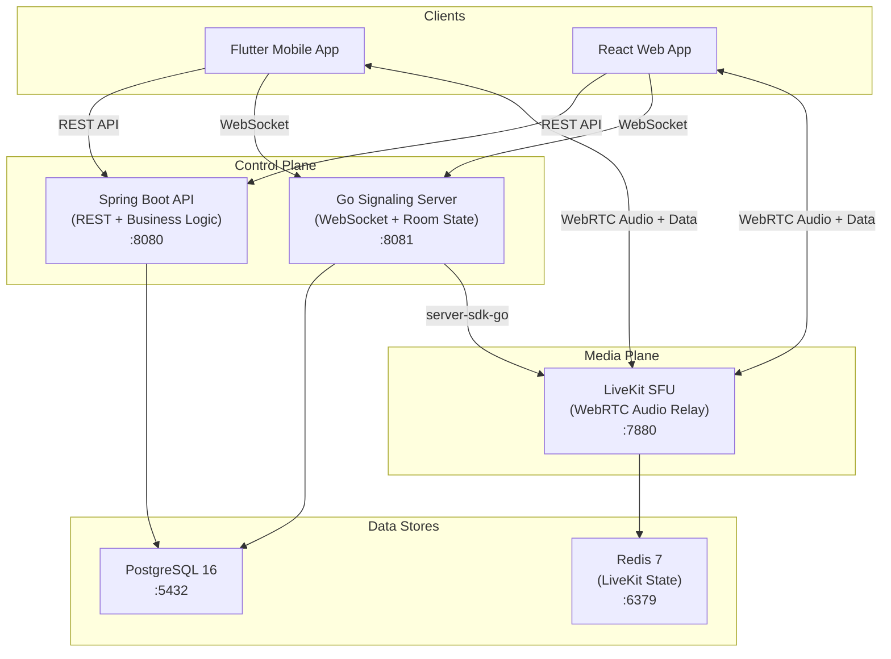
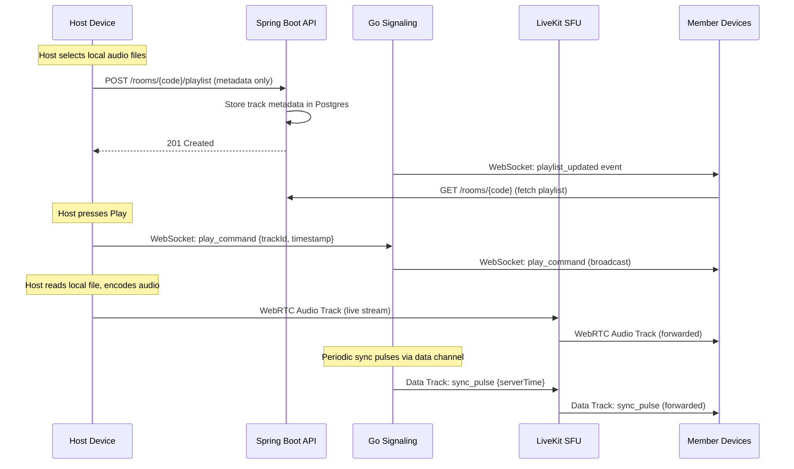
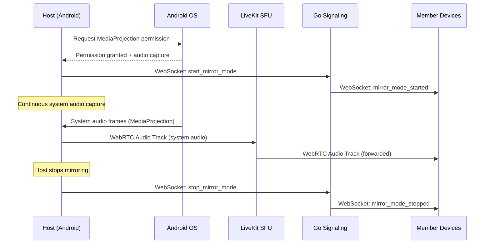
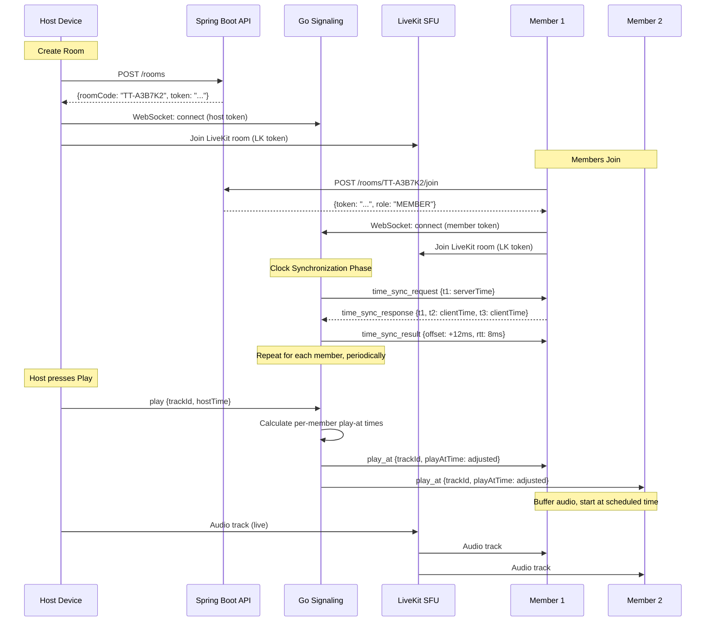

# TuneTogether — System Architecture

## Overview

TuneTogether is a synced multi-device audio room application. It separates concerns into two planes:

- **Control Plane**: REST API (Spring Boot) + WebSocket signaling (Go) for room management, playlist sync, and playback commands
- **Media Plane**: WebRTC audio streaming via LiveKit SFU for low-latency audio delivery

## System Architecture Diagram



## Component Responsibilities

### Spring Boot REST API (`/api`)
- **Room lifecycle**: Create, join, close rooms
- **Auth**: Issue room-scoped JWTs (host/member tokens)
- **Playlist metadata**: CRUD for track metadata (title, artist, duration, order)
- **User management**: Lightweight user records (expandable to full accounts)
- **Data persistence**: All durable state in PostgreSQL via JPA + Flyway migrations

### Go Signaling Server (`/realtime`)
- **WebSocket connections**: Persistent connections with all room members
- **Playback commands**: Relay host commands (play, pause, seek, skip) to all members in real-time
- **Clock synchronization**: NTP-style time sync protocol between server and clients
- **Room state**: Track who's connected, current playback position, sync offsets
- **LiveKit integration**: Generate LiveKit access tokens, manage LiveKit rooms via `server-sdk-go`

### LiveKit SFU
- **Audio forwarding**: Receives audio track from host, selectively forwards to all subscribers
- **Data channels**: Reliable + lossy data tracks for sync signals alongside audio
- **Transport**: Handles WebRTC negotiation, ICE, DTLS, SRTP
- **Self-hosted**: Runs as Docker container with Redis for state

### PostgreSQL
- Durable storage for users, rooms, memberships, playlist tracks
- Schema managed by Flyway migrations in Spring Boot

### Redis
- LiveKit's internal state management (room presence, participant tracking)
- Not directly accessed by application code

## Traffic Flow Diagrams

### Feature 1: Local Playlist Sync



### Feature 2: Live Device-Audio Mirroring (Android Only)



### Feature 3: Room + Sync Engine



## Sync Engine Design

### Goal
All devices play audio within <30ms of each other.

### Strategy: "Make everyone equally late"

1. **Clock Sync**: NTP-style protocol over WebSocket
   - Server sends `t1` (server timestamp)
   - Client responds with `t2` (client receive time) and `t3` (client send time)
   - Server calculates: `offset = ((t2 - t1) + (t3 - t4)) / 2`, `rtt = (t4 - t1) - (t3 - t2)`
   - Repeated periodically (every 5s), using moving median for stability

2. **Buffered Playback**: Instead of playing audio immediately on receipt:
   - All clients buffer incoming audio for a fixed window (e.g., 100ms)
   - Play commands include an absolute "play-at" time adjusted for each client's clock offset
   - Clients schedule playback using high-resolution audio APIs (Web Audio API / Android AudioTrack)

3. **Drift Correction**: Periodic sync pulses via LiveKit data tracks
   - Server broadcasts heartbeat with current playback position
   - Clients compare and micro-adjust playback rate (±0.1%) to converge

### Why Not "Just Send and Hope"?
- Network jitter: 5–50ms variation per packet
- Device processing: 10–100ms variation per device
- Clock drift: 20–100 ppm between devices
- Without sync, devices will audibly diverge within seconds

## Security Model

### Room-Scoped JWT (v1)
```
Authorization: Bearer <JWT>
```

JWT Claims:
- `sub`: user UUID
- `roomId`: room UUID
- `roomCode`: room code string
- `role`: HOST | MEMBER
- `displayName`: user's chosen display name
- `exp`: 24h expiry

### Endpoint Authorization
| Role | Can Do |
|---|---|
| **No auth** | Create room, join room |
| **MEMBER** | View room state, receive audio |
| **HOST** | All member actions + manage playlist, playback controls, close room |

## Legal Guardrail

**Hard boundary enforced at architecture level:**
- No URL/stream fetching endpoints exist in any service
- Audio enters the system ONLY from the host device (local file read or MediaProjection capture)
- Server never stores, caches, or processes audio bytes — LiveKit SFU forwards opaque RTP packets
- Playlist tracks table stores metadata only (title, artist, duration) — no file paths, no URLs, no binary data
